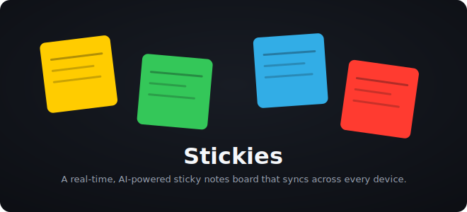

<div align="center">

# stickies

**A real-time, AI-powered sticky notes board that syncs across every device.**

Colorful draggable notes with folder organization, markdown rendering, and live cross-device sync.

[](LICENSE)




</div>

## Why

Sticky notes are the fastest way to capture a thought, but most note apps are either
single-device or slow to sync. Stickies keeps a board of colorful, draggable notes in sync
across every device in real time, adds folders so the board never turns into chaos, and
layers in AI for diagram generation and content help. It also exposes a full REST API and
a CLI, so notes can be created and read programmatically, not just by hand.

## Features

- Colorful draggable sticky notes with folder organization
- Real-time sync across devices via Pusher WebSockets
- AI-powered diagram generation (Mermaid) and content assistance via Claude
- Markdown rendering with code syntax highlighting (Prism.js, highlight.js)
- QR code sharing for individual notes
- PDF parsing and import
- Email sharing via Resend
- Google Drive integration plus backup and restore
- Push notifications and automation workflows
- A full REST API for programmatic access, plus a CLI (`npm run stickies`)
- Auth with Google OAuth and automatic localhost bypass for LAN development

## Tech stack

| Layer | Technology |
|-------|-----------|
| Framework | Next.js 16 (App Router) |
| Language | TypeScript, React 19 |
| Styling | Tailwind CSS |
| Database | Supabase (PostgreSQL) |
| Auth | Supabase Auth + Google OAuth |
| Real-time | Pusher WebSockets |
| AI | Claude API (`@anthropic-ai/sdk`) |
| Email | Resend |
| Testing | Vitest + Playwright |
| Hosting | Vercel |

## Install

```bash
git clone https://github.com/bunlongheng/stickies
cd stickies
npm install
```

Then create a `.env.local` with the variables below before running.

## Quick start

```bash
npm run dev      # start the dev server on port 4444
npm run build    # production build
npm run start    # start the production server
npm run prod     # build then start on port 4444
```

Open [http://localhost:4444](http://localhost:4444).

## Usage

### Scripts

```bash
npm run dev              # Start dev server on port 4444
npm run build            # Production build
npm run start            # Start production server
npm run prod             # Build + start on port 4444
npm run stickies         # CLI for posting and reading notes
npm run test             # Run Vitest unit tests
npm run test:watch       # Vitest in watch mode
npm run test:coverage    # Vitest with coverage
npm run test:e2e         # Playwright end-to-end tests
npm run test:ui:headed   # Playwright with browser UI
npm run smoke            # Smoke test: signup flow
npm run smoke:images     # Smoke test: image handling
npm run smoke:flow       # Smoke test: user flow
npm run smoke:pages      # Smoke test: all pages
```

### CLI

The `stickies` CLI talks to the REST API from your terminal:

```bash
npm run stickies -- new "My Note" "Content here" --folder NOTES
npm run stickies -- list --folder NOTES
npm run stickies -- folders
npm run stickies -- get <id>
npm run stickies -- delete <id>
npm run stickies -- search "keyword"
echo "# Title\n\nContent" | npm run stickies -- post
```

Commands: `new`, `list`, `folders`, `get`, `delete`, `search`, and `post` (pipe stdin as
note content).

## How it works

Stickies is a Next.js App Router app organized into route groups: `(app)` for the main
board, `sign-in` for auth, `share` for public note links, and `tools` for utilities. The
API layer under `/api/stickies/*` exposes a full REST interface for CRUD, AI generation,
file uploads, backups, automations, and integrations. Pusher broadcasts every mutation to
all connected clients for real-time sync, Supabase handles persistence and auth (with a
localhost and LAN bypass for local development), and Claude powers the AI features.

### Project structure

```
app/
  (app)/                    # Main board (route group)
  api/
    auth/                   # OAuth callback, email check
    hue/                    # Smart light integration
    stickies/
      ai/                   # Claude-powered generation
      ai-mode/              # AI mode toggle
      automation-logs/      # Automation history
      automations/          # Scheduled workflows
      backup/               # Backup & restore
      ext/                  # Browser extension API
      folder-icon/          # Folder icon management
      gdrive/               # Google Drive sync
      img-proxy/            # Image proxy
      integrations/         # Third-party integrations
      local/                # Local-only endpoints
      magic/                # Magic link auth
      public/               # Public share endpoints
      push-nav/             # Push notification nav
      push-subscribe/       # Push subscription
      share/                # Share via link/email
      upload/               # File uploads
  share/                    # Public shared note page
  sign-in/                  # Auth page
  tools/stickies/           # Stickies tooling
```

### Environment variables

| Variable | Purpose |
|----------|---------|
| `ANTHROPIC_API_KEY` | Claude API for AI features |
| `NEXT_PUBLIC_SUPABASE_URL` | Supabase project URL |
| `NEXT_PUBLIC_SUPABASE_ANON_KEY` | Supabase anonymous key (client) |
| `SUPABASE_SERVICE_ROLE_KEY` | Supabase service role key (server only) |
| `DATABASE_URL` | Direct Postgres connection |
| `PUSHER_APP_ID` | Pusher app identifier |
| `PUSHER_KEY` | Pusher server key |
| `PUSHER_SECRET` | Pusher server secret |
| `PUSHER_CLUSTER` | Pusher cluster region |
| `NEXT_PUBLIC_PUSHER_KEY` | Pusher client key |
| `NEXT_PUBLIC_PUSHER_CLUSTER` | Pusher client cluster |
| `GOOGLE_CLIENT_ID` | Google OAuth client ID |
| `GOOGLE_CLIENT_SECRET` | Google OAuth client secret |
| `OWNER_EMAIL` | Owner email for admin features |
| `STICKIES_API_KEY` | API key for programmatic access |
| `RESEND_API_KEY` | Resend email service key |

## License

[MIT](LICENSE)
