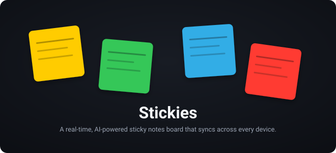

<div align="center">

# stickies

**A real-time, AI-powered sticky notes board that syncs across every device.**

Colorful draggable notes with folder organization, rich HTML content, and live cross-device sync.

[](LICENSE)




</div>

## Why

Sticky notes are the fastest way to capture a thought, but most note apps are either
single-device or slow to sync. Stickies keeps a board of colorful, draggable notes in sync
across every device in real time, adds folders so the board never turns into chaos, and
layers in AI for diagram generation and content help. It also exposes a full REST API and
a CLI, so notes can be created and read programmatically, not just by hand.

## Features

- Colorful draggable sticky notes with folder organization
- Real-time sync across devices via Pusher WebSockets
- AI-powered diagram generation (Mermaid) and content assistance via Claude
- Rich HTML notes plus code syntax highlighting (Prism.js)
- QR code sharing for individual notes
- PDF parsing and import
- Google Drive integration plus backup and restore
- Automation workflows (trigger/condition/action engine with per-automation logs)
- A full REST API for programmatic access, plus a CLI (`npm run stickies`)
- Owner-gated auth with Google OAuth (NextAuth v5)

## Tech stack

| Layer | Technology |
|-------|-----------|
| Framework | Next.js 16 (App Router) |
| Language | TypeScript, React 19 |
| Styling | Tailwind CSS |
| Database | PostgreSQL (self-hosted, `pg`) |
| Auth | NextAuth v5 (Auth.js) + Google OAuth |
| Real-time | Pusher WebSockets |
| AI | Claude API (`@anthropic-ai/sdk`) |
| Testing | Vitest + Playwright |
| Hosting | Vercel |

## Install

```bash
git clone https://github.com/bunlongheng/stickies
cd stickies
npm install
```

Then copy `.env.example` to `.env.local` and fill it in - it documents every runtime variable (required, optional, and script-only), including the required `OWNER_USER_ID` that the ext API resolves notes against. The table below is a quick summary; `.env.example` is the source of truth.

### Database

Point `DATABASE_URL` at a PostgreSQL database, then create the schema:

```bash
npm run migrate
```

The runner applies every unrun file in `supabase/migrations/` in order and records it
in a `schema_migrations` ledger, so it is safe to re-run. Against a database that
already has a `stickies` table it baselines instead, marking the existing migrations
as applied without executing any SQL.

## Quick start

```bash
npm run dev      # start the dev server on port 4444
npm run build    # production build
npm run start    # start the production server
npm run prod     # build then start on port 4444
```

Open [http://localhost:4444](http://localhost:4444).

## Usage

### Scripts

```bash
npm run dev              # Start dev server on port 4444
npm run build            # Production build
npm run start            # Start production server
npm run prod             # Build + start on port 4444
npm run stickies         # CLI for posting and reading notes
npm run test             # Run Vitest unit tests
npm run test:watch       # Vitest in watch mode
npm run test:coverage    # Vitest with coverage
npm run test:e2e         # Playwright end-to-end tests
npm run test:ui:headed   # Playwright with browser UI
```

### CLI

The `stickies` CLI talks to the REST API from your terminal:

```bash
npm run stickies -- new "My Note" "Content here" --folder NOTES
npm run stickies -- list --folder NOTES
npm run stickies -- folders
npm run stickies -- get <id>
npm run stickies -- search "keyword"
echo "# Title\n\nContent" | npm run stickies -- post
```

Commands: `new`, `list`, `folders`, `get`, `search`, and `post` (pipe stdin as note
content). Deletes are owner-browser only - the ext API rejects delete from API keys, so
there is no CLI delete.

## How it works

Stickies is a Next.js App Router app organized into route groups: `(app)` for the main
board, `sign-in` for auth, `share` for public note links, and `tools` for utilities. The
API layer under `/api/stickies/*` exposes a full REST interface for CRUD, AI generation,
file uploads, backups, automations, and integrations. Pusher broadcasts every mutation to
all connected clients for real-time sync, a self-hosted PostgreSQL database (accessed
through the `pg` pool) handles persistence, NextAuth v5 (Auth.js) with Google OAuth handles
owner-gated sign-in with sessions stored in Postgres, and Claude powers the AI features.

### Project structure

```
app/
  (app)/                    # Main board (route group)
  api/
    auth/                   # OAuth callback, email check
    hue/                    # Smart light integration
    stickies/
      ai/                   # Claude-powered note assist (streaming)
      automation-logs/      # Automation history
      automations/          # Server-side trigger/action engine
      backup/               # Backup & restore
      ext/                  # External REST API (agents, CLI, automations)
      folder-icon/          # Folder icon management
      gdrive/               # Google Drive sync
      integrations/         # Third-party integrations (Hue, Drive)
      keys/                 # Per-app API key mint/revoke
      local/                # Local-only endpoints
      logout/               # Session logout
      public/               # Public share endpoints
      push-subscribe/       # Push subscription
      share/                # Share via link/email
      upload/               # File uploads
  embed/                    # Embeddable single-note view (iframe)
  raw/                      # Raw note content endpoint
  share/                    # Public shared note page
  sign-in/                  # Auth page
  tools/stickies/           # Stickies tooling
```

### Environment variables

| Variable | Purpose |
|----------|---------|
| `ANTHROPIC_API_KEY` | Claude API for AI features |
| `DATABASE_URL` | PostgreSQL connection string |
| `AUTH_SECRET` | NextAuth session encryption secret |
| `GOOGLE_CLIENT_ID` | Google OAuth client ID |
| `GOOGLE_CLIENT_SECRET` | Google OAuth client secret |
| `OWNER_EMAIL` | Email allowed to sign in (owner-gated) |
| `OWNER_USER_ID` | Owner UUID the ext API resolves notes against (required) |
| `STICKIES_API_KEY` | Bearer key for the ext API (agents/CLI) |
| `PUSHER_APP_ID` | Pusher app identifier |
| `PUSHER_KEY` | Pusher server key |
| `PUSHER_SECRET` | Pusher server secret |
| `PUSHER_CLUSTER` | Pusher cluster region |
| `NEXT_PUBLIC_PUSHER_KEY` | Pusher client key |
| `NEXT_PUBLIC_PUSHER_CLUSTER` | Pusher client cluster |

## Contributing

Bug reports and pull requests are welcome - see [CONTRIBUTING.md](CONTRIBUTING.md) for
setup and the checks to run before opening one. For anything security-related, follow
[SECURITY.md](SECURITY.md) rather than filing a public issue.

## License

[MIT](LICENSE)
