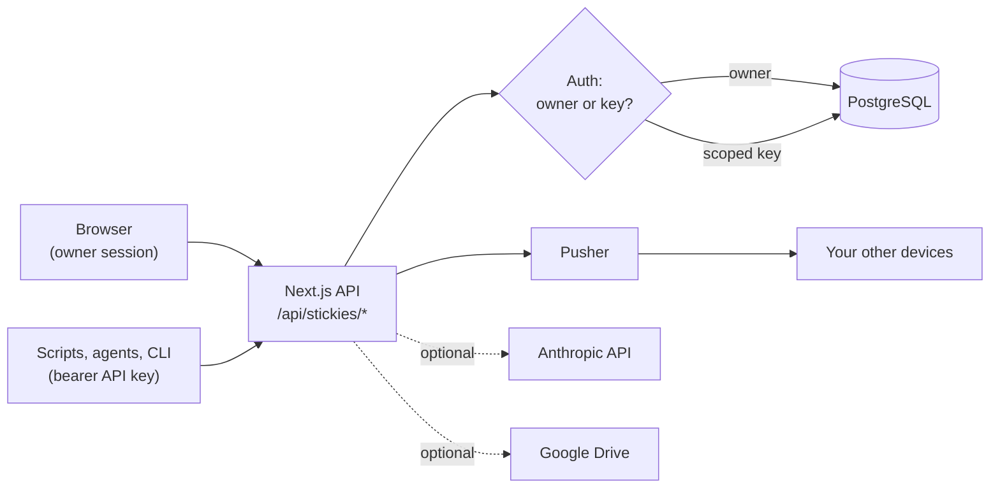
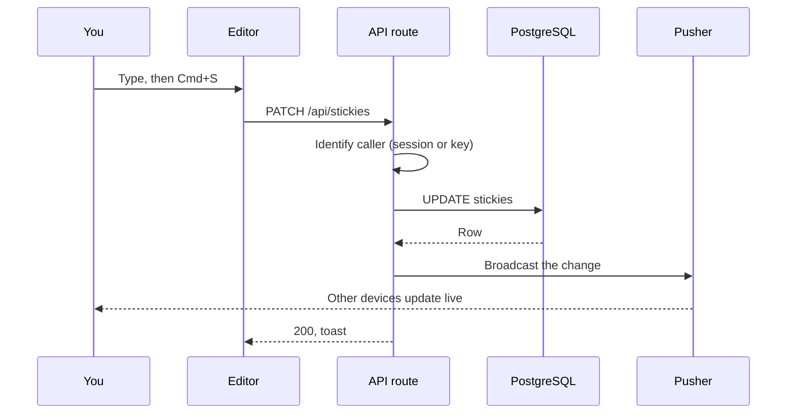

<div align="center">

# Stickies

**A self-hosted sticky-notes board that syncs across every device you own.**

Colourful, draggable notes with folders, rich HTML content, a REST API, and real-time sync.

[](LICENSE)


</div>

## Read this before you clone

**This is not a product you sign up for, and it will not work out of the box.** It is a
self-hosted application. You run it, on infrastructure you provide and pay for.

Concretely, before it will start you need:

| You must provide | Why | Free option? |
|------------------|-----|--------------|
| **A PostgreSQL database** | Every note, folder and session is stored here. There is no bundled database, no SQLite fallback, no hosted backend | Yes - local Postgres, Neon, Supabase, Railway |
| **Google OAuth credentials** | Google is the only sign-in provider. Without it you cannot log in at all | Yes - Google Cloud Console |
| **Somewhere to run it** | It is a Next.js server, not a static site. Vercel, Fly, Railway, a VPS, or just your own machine | Yes - Vercel free tier, or localhost |

**Where your notes live:** in *your* Postgres database. Nothing is sent to a service
run by me, and there is no account with anyone. That is the point - but it also means
backups, uptime and cost are yours.

**It is single-owner by design.** Only the one Google account matching `OWNER_EMAIL`
can sign in. There is no sign-up, no multi-user mode, no sharing between accounts.
If you want a notes app several people log into, this is the wrong repo.

**Optional extras**, each of which the app runs fine without:

| Skip it and... | Service |
|----------------|---------|
| No live updates between devices; you refresh to see changes | Pusher |
| The AI prompt bar and diagram generation are unavailable | Anthropic API key |
| File uploads are unavailable | Google Drive OAuth |

## Contents

- [Read this before you clone](#read-this-before-you-clone)
- [Features](#features)
- [Quick start](#quick-start)
- [Configuration](#configuration)
- [Architecture](#architecture)
- [How a note is saved](#how-a-note-is-saved)
- [Tech stack](#tech-stack)
- [Project layout](#project-layout)
- [Testing](#testing)
- [Contributing](#contributing)
- [License](#license)

## Features

- Colourful, draggable notes organised into nestable folders
- Plain-text, checklist and rich HTML notes, with code syntax highlighting
- Real-time sync across devices over WebSockets (when Pusher is configured)
- A full REST API plus a CLI, so notes can be created and read by scripts and agents
- Scoped API keys: per-app tokens, stored hashed, revocable one at a time
- AI prompt bar and Mermaid diagram generation (when an Anthropic key is configured)
- Public share links and embeddable single-note views
- Soft delete to TRASH with a 7-day window, and `Cmd+Delete` to skip the confirm
- Backup and restore, plus Google Drive file uploads
- An automation engine (trigger / condition / action) with per-automation logs

## Quick start

```bash
git clone https://github.com/bunlongheng/stickies.git
cd stickies
npm install
cp .env.example .env.local     # then fill in the REQUIRED block
npm run migrate                # create the schema in your database
npm run dev                    # http://localhost:4444
```

`npm run migrate` applies every unrun file in `supabase/migrations/` in order and
records it in a `schema_migrations` ledger, so it is safe to re-run. Against a
database that already has a `stickies` table it baselines instead, marking the
existing migrations as applied without executing any SQL.

If the app starts but every request fails, `DATABASE_URL` is almost certainly wrong -
the connection pool throws on its first query rather than at boot.

## Configuration

`.env.example` is the source of truth and documents every variable. The essentials:

| Env var | Required | Purpose |
|---------|----------|---------|
| `DATABASE_URL` | **yes** | Postgres connection string. Empty means the pool crashes on first query |
| `AUTH_SECRET` | **yes** | NextAuth session signing secret. `openssl rand -base64 32` |
| `OWNER_EMAIL` | **yes** | The one Google account allowed to sign in |
| `OWNER_USER_ID` | **yes** | The owner id every note is filed under |
| `GOOGLE_CLIENT_ID` / `GOOGLE_CLIENT_SECRET` | **yes** | Google OAuth app credentials |
| `DATABASE_CA_CERT` | recommended | Server CA for verified DB TLS. Without it, remote Postgres TLS is unverified |
| `PUSHER_*` / `NEXT_PUBLIC_PUSHER_*` | no | Real-time sync. Omit and the board still works, just without live updates |
| `ANTHROPIC_API_KEY` | no | AI prompt bar and diagram generation |
| `STICKIES_API_KEY` | no | Static bearer token for the REST API and CLI |

## Architecture

A Next.js App Router application talking to Postgres directly through `pg`. Every
mutation is broadcast over Pusher so other devices update without polling. Auth has two
distinct paths: a browser owner session, and bearer API keys for scripts and agents.


```mermaid
flowchart LR
    Browser["Browser<br/>(owner session)"] --> API["Next.js API<br/>/api/stickies/*"]
    Agents["Scripts, agents, CLI<br/>(bearer API key)"] --> API
    API --> Auth{"Auth:<br/>owner or key?"}
    Auth -->|owner| DB[("PostgreSQL")]
    Auth -->|scoped key| DB
    API --> Pusher["Pusher"]
    Pusher --> Devices["Your other devices"]
    API -.optional.-> Claude["Anthropic API"]
    API -.optional.-> Drive["Google Drive"]
```

| Layer | Responsibility |
|-------|----------------|
| `app/(app)` | The board: list and tabs views, the editor, folders, search |
| `app/api/stickies/*` | REST surface for CRUD, AI, uploads, backups, automations, keys |
| `auth.ts` + `middleware.ts` | NextAuth v5 owner gate |
| `lib/` | Pure logic: tile styling, note icons, editor state, realtime hook |
| `supabase/migrations/` | Schema, applied in order by `db/migrate.mjs` |

## How a note is saved


```mermaid
sequenceDiagram
    participant U as You
    participant E as Editor
    participant A as API route
    participant D as PostgreSQL
    participant P as Pusher
    U->>E: Type, then Cmd+S
    E->>A: PATCH /api/stickies
    A->>A: Identify caller (session or key)
    A->>D: UPDATE stickies
    D-->>A: Row
    A->>P: Broadcast the change
    P-->>U: Other devices update live
    A-->>E: 200, toast
```

Autosave is deliberately off for plain-text and checklist notes: they save on `Cmd+S`.
Rich-text notes debounce-save as you type.

## Tech stack

- **Next.js 16** (App Router), **React 19**, **TypeScript**
- **PostgreSQL** via `pg` - no ORM
- **NextAuth v5** (Auth.js) with Google OAuth, sessions in Postgres
- **Pusher** WebSockets for real-time sync
- **Tailwind CSS**, **TipTap** for rich text, **Prism** for code
- **Vitest** + **Playwright** for tests
- Deployed on **Vercel**; any Node host works

## Project layout

```
app/
  (app)/          the board UI: list, tabs, editor, folders, search
  api/stickies/   REST API: CRUD, ext, ai, keys, gdrive, backup, automations
  embed/ share/   public single-note views
auth.ts           NextAuth v5 config (Google, owner gate)
middleware.ts     route protection
components/       shared React components
lib/              pure logic: tile styles, note icons, realtime, editor state
db/migrate.mjs    migration runner
supabase/migrations/  schema, applied in order
scripts/          CLI, hub server, maintenance scripts
tests/            unit, integration, e2e, perf
```

## Testing

```bash
npm run test       # 754 unit + integration tests, no database needed
npm run test:e2e   # 91 Playwright tests across Chrome, iPad and iPhone
npm run lint
npx tsc --noEmit
```

The unit suite mocks the database, so it runs anywhere. The e2e suite drives a real
server against a real database and reuses whatever is serving port 4444.

## Contributing

Bug reports and pull requests are welcome - see [CONTRIBUTING.md](CONTRIBUTING.md).
For anything security-related, follow [SECURITY.md](SECURITY.md) rather than filing a
public issue.

## License

[MIT](LICENSE) (c) Bunlong Heng

---

<div align="center">

**Built by Bunlong Heng**

[Portfolio](https://bunlongheng.com) &nbsp;·&nbsp; [All projects](https://bunlongheng.com/projects) &nbsp;·&nbsp; [GitHub](https://github.com/bunlongheng)

<sub>Stickies is one of a set of small, self-hosted tools. The rest live on the projects page.</sub>

</div>
