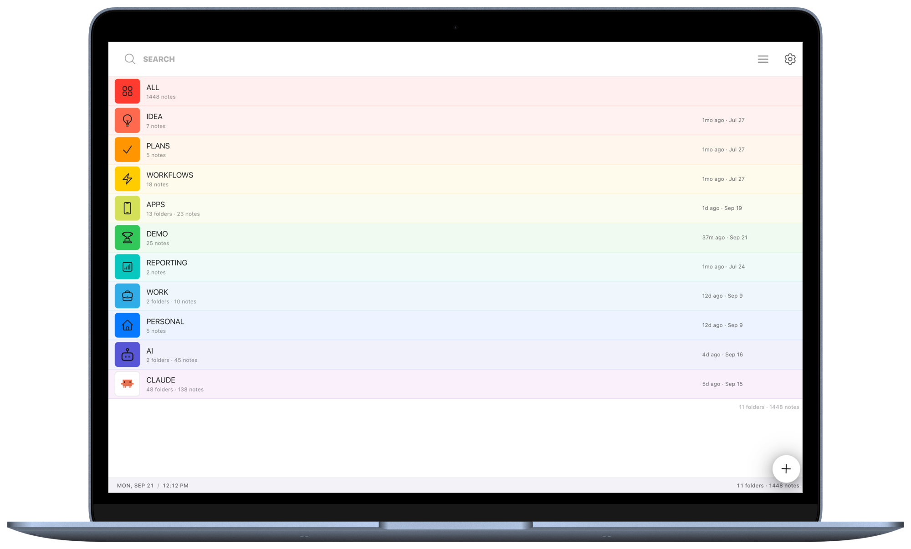
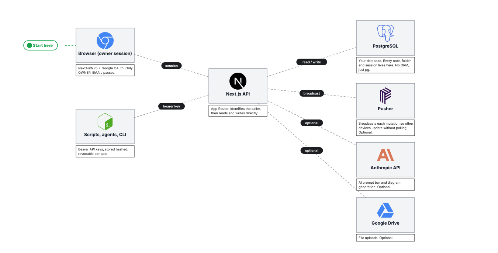
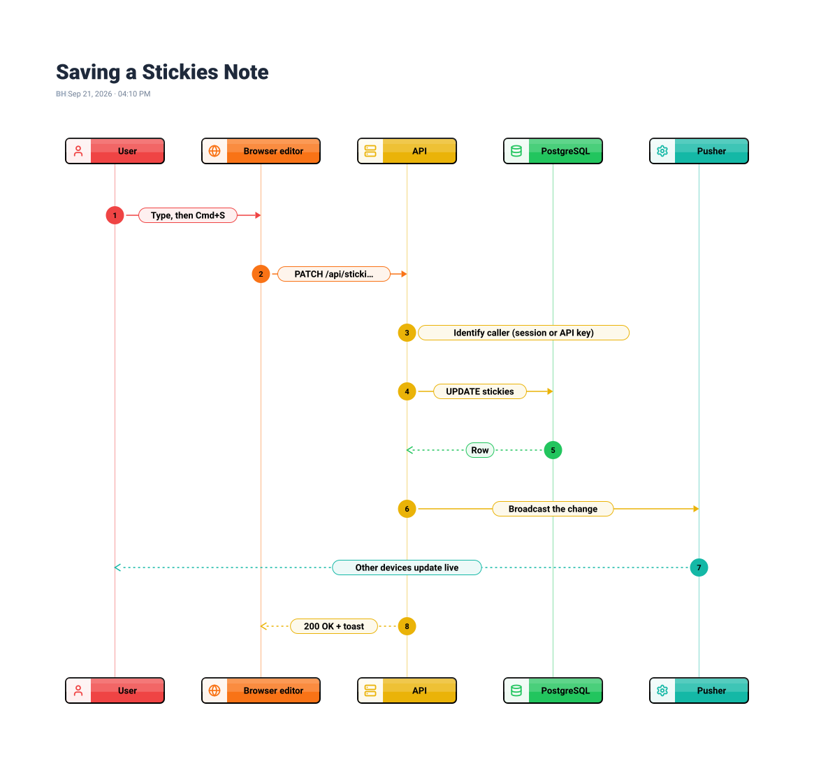

<div align="center">

#  Stickies

**A self-hosted sticky-notes board that syncs across every device you own.**

Colourful, draggable notes with folders, rich HTML content, a REST API, and real-time sync.




</div>

## Read this before you clone

**This will not work out of the box.** It is self-hosted: you run it on infrastructure you provide.

| You provide | Why | Free option |
|---|---|---|
| **PostgreSQL** | Every note, folder and session lives here. No bundled DB, no SQLite fallback | local, Neon, Supabase, Railway |
| **Google OAuth** | The only sign-in provider. Without it you cannot log in | Google Cloud Console |
| **A host** | A Next.js server, not a static site | Vercel free tier, or localhost |

**Your notes live in your database.** Nothing reaches a service of mine, and there is no account with anyone. Backups, uptime and cost are equally yours.

**Single-owner by design.** Only the Google account matching `OWNER_EMAIL` can sign in. No sign-up, no multi-user mode. If you want a board several people log into, this is the wrong repo.

**Optional:** Pusher (without it, no live updates), an Anthropic key (no AI bar), Google Drive (no uploads).

## Features

- Colourful, draggable notes in nestable folders; plain text, checklists or rich HTML
- Real-time sync across your devices over WebSockets
- A REST API and a CLI, so scripts and agents can read and write notes
- Scoped API keys: per-app, stored hashed, revocable one at a time
- Public share links and embeddable single notes
- Soft delete to TRASH with a 7-day window; `Cmd+Delete` skips the confirm

## Quick start

```bash
git clone https://github.com/bunlongheng/stickies.git
cd stickies
npm install
cp .env.example .env.local     # then fill in the REQUIRED block
npm run migrate                # create the schema in your database
npm run dev                    # http://localhost:4444
```

`npm run migrate` applies every unrun file in `supabase/migrations/` in order and
records it in a `schema_migrations` ledger, so it is safe to re-run. Against a
database that already has a `stickies` table it baselines instead, marking the
existing migrations as applied without executing any SQL.

If the app starts but every request fails, `DATABASE_URL` is almost certainly wrong -
the connection pool throws on its first query rather than at boot.

## Configuration

`.env.example` documents every variable. Required to boot: `DATABASE_URL`, `AUTH_SECRET`,
`OWNER_EMAIL`, `OWNER_USER_ID`, `GOOGLE_CLIENT_ID` and `GOOGLE_CLIENT_SECRET`.
Set `DATABASE_CA_CERT` too, or remote Postgres TLS goes unverified.

## Architecture

A Next.js App Router app talking to Postgres through `pg`, broadcasting every change over Pusher. Two auth paths: a browser owner session, and bearer API keys for scripts.

The data layer can also run as a standalone service. See [Running against stickies-api](#running-against-stickies-api).

<a href="https://flows-bheng.vercel.app/?id=725b4551-4440-49b6-a90b-d9fcadef7cbb">
  
</a>

<sub>Diagram made with [Flows](https://flows-bheng.vercel.app).</sub>

## How a note is saved

<a href="https://sequences-bheng.vercel.app/d/c974e83b-441b-4535-990f-38629466bdf7">
  
</a>

Autosave is deliberately off for plain-text and checklist notes: they save on `Cmd+S`.
Rich-text notes debounce-save as you type.

<sub>Made with [Sequences](https://sequences-bheng.vercel.app).</sub>

Autosave is off for text and checklist notes on purpose: they save on `Cmd+S`. Rich text debounces as you type.

## Running against stickies-api

The API lives in its own repo at [`stickies-api`](../stickies-api/README.md), a
6-dependency Hono service. `stickies-native` already calls it; this app can too.
One variable decides:

```bash
# .env.local
NEXT_PUBLIC_STICKIES_API_BASE=http://localhost:4446
```

Unset, this app serves itself from `app/api/stickies/*` exactly as it always
has, and the 755-test suite covers that path. Set, every client call goes to the
service instead and the local route handlers go unused.

| Piece | What it does |
|---|---|
| `lib/api-client.ts` | The seam. Rewrites `/api/stickies` to `/notes`, attaches the bearer token. |
| `lib/fetch-retry.ts` | Routes through the seam, so its call sites needed no edit. |
| `lib/realtime-channel.ts` | One `bind`/`close` interface over Pusher **or** SSE, picked by the same flag. |

`useRealtimeSync` did not change: it binds the same event names either way.
When the flag is on, realtime is an `EventSource` against `/live` and Pusher is
never constructed, which drops a paid dependency and the 10KB event ceiling that
made notes over 10KB silently fail to arrive live.

`/api/auth/*` is excluded from the rewrite on purpose. NextAuth owns the sign-in
pages and the session cookie, and stays here.

**The service has to be running.** With the flag set and nothing on that port the
board comes up empty, which is why it ships commented out in `.env.local`.

## Tech stack

Next.js 16 · React 19 · TypeScript · PostgreSQL (`pg`, no ORM) · NextAuth v5 · Pusher · Tailwind · TipTap · Vitest + Playwright

Optionally [`stickies-api`](../stickies-api/README.md) in place of the built-in routes: Hono · SSE · JWT.

## Contributing

See [CONTRIBUTING.md](CONTRIBUTING.md) for setup and the checks to run. Security issues go through [SECURITY.md](SECURITY.md), never a public issue.

## License

[MIT](LICENSE) (c) Bunlong Heng

---

<div align="center">

<a href="https://bunlongheng.com"></a>
<a href="https://www.linkedin.com/in/bunlongheng/"></a>
<a href="https://www.instagram.com/ibunlong/"></a>
<a href="mailto:bheng.code@gmail.com"></a>

<br>

Built by **[Bunlong](https://bunlongheng.com)** &nbsp;·&nbsp; [more apps](https://bunlongheng.com/projects)

</div>
